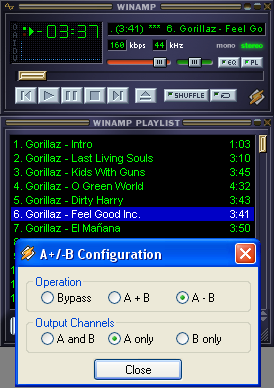

# AB Analysis Tool
I wrote this in December 2006, and was my first foray into plugin development. Super simple, but useful for mix analysis.
- A-B: subtract right from left channel = center removal
- A+B: sum left and right channels = mono mix

`DSP.h` is the header from the Winamp SDK.

# Original `readme.txt`

Just dump these files into a blank DLL project, and it should compile!

-Note the .nsi file is the Nullsoft Installer Script, do not include in the compiling process
